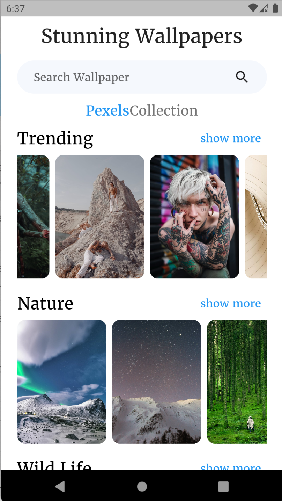
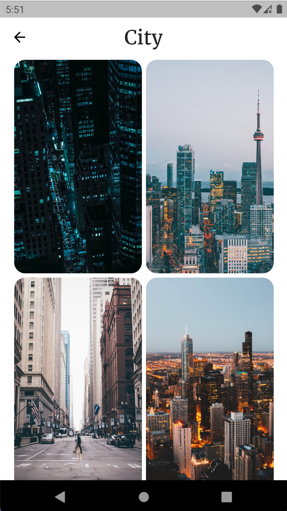
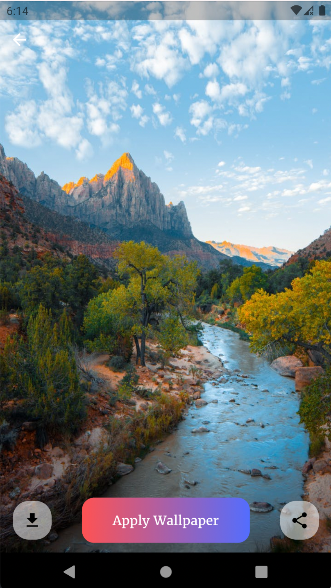
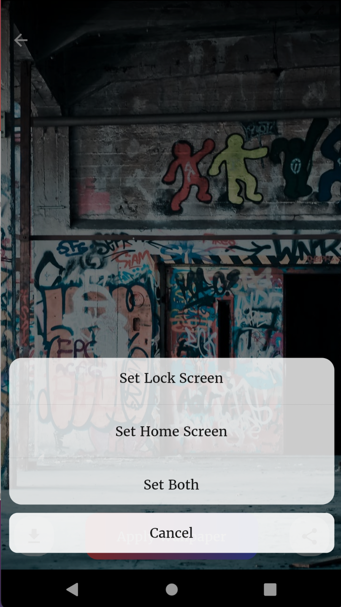
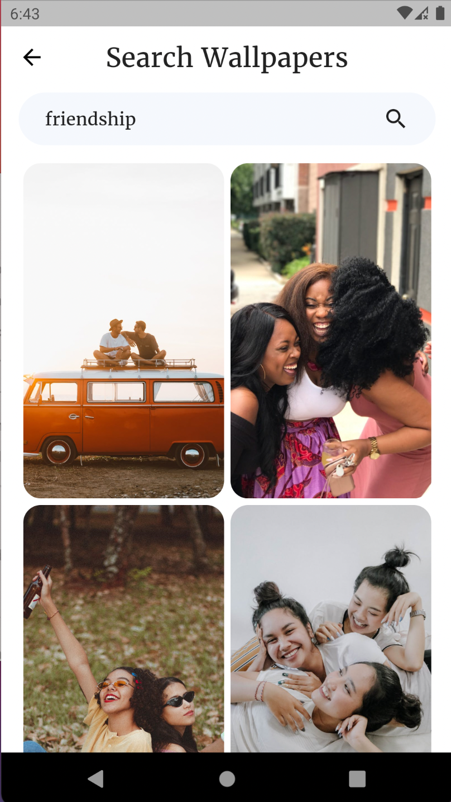

# Stunning Wallpapers App

Stunning Wallpapers app is here to provide you a collection of stunning and favourite wallpapers. Get this app and search your favourite wallpapers.

Features:

* Wallpaper List of pre-defined categories.
* Search option to get your favourite wallpapers easily.
* Download option to download wallpapers in your mobile.
* You can set any wallpaper to Home Screen, Lock Screen or on Both Screens.
* Share option is available to share wallpaper with others.

## Screenshots of App

 
 

## Available on Playstore

[Download Stunning Wallpapers App](https://play.google.com/store/apps/details?id=com.siyalapps.wallpaperapp)

## How to Run

Go to lib/constants/strings.dart, add your pexels api key and admob ad unit id's. Then, run the following commands:

* flutter pub get
* flutter run
